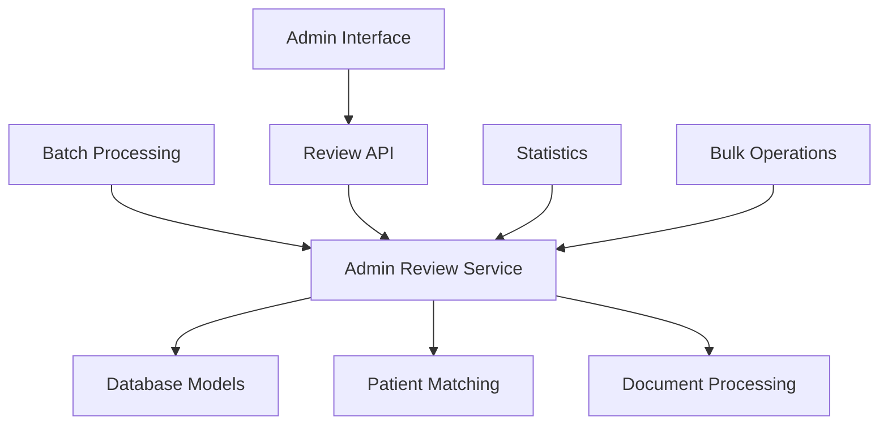
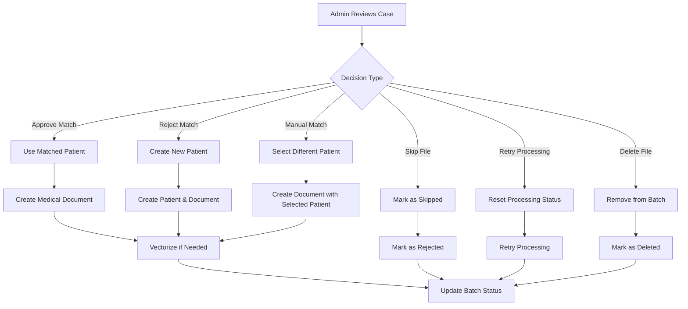

# Admin Review Interface Integration Guide

## Overview

The Admin Review Interface provides a comprehensive solution for administrative review of batch document processing cases. This interface allows administrators to make decisions on files that require manual review due to patient matching ambiguities, parsing errors, or processing failures.

## Architecture

### Components

1. **AdminReviewService**: Core service handling review logic
2. **Admin Review API Endpoints**: RESTful API for review operations
3. **Database Models**: Extended batch processing models
4. **Interactive Demo**: Testing and demonstration tools

### Integration Points



## API Endpoints

### Base URL: `/api/v1/admin`

### 1. Get Pending Reviews
```http
GET /admin/review/pending
```

**Query Parameters:**
- `session_id` (optional): Filter by batch session ID
- `priority` (optional): Filter by priority (high, medium, low)
- `category` (optional): Filter by category (patient_match, parsing_error, processing_error)
- `limit` (optional): Maximum number of cases (default: 50)

**Response:**
```json
[
  {
    "batch_file_id": 123,
    "filename": "3000003799_GARZA TIJERINA, MARIA ESTHER_6001467010_CONS.pdf",
    "session_id": "uuid-string",
    "parsed_patient_id": "3000003799",
    "parsed_patient_name": "GARZA TIJERINA, MARIA ESTHER",
    "parsed_document_type": "CONS",
    "patient_matching_status": "review_required",
    "processing_status": "pending",
    "matching_confidence": 0.85,
    "error_message": null,
    "suggested_matches": [
      {
        "patient_id": 456,
        "similarity": 0.85,
        "name": "GARZA TIJERINA, MARIA ESTHER"
      }
    ],
    "review_priority": "medium",
    "review_category": "patient_match",
    "created_at": "2024-01-15T10:30:00Z"
  }
]
```

### 2. Make Admin Decision
```http
POST /admin/review/{batch_file_id}/decision
```

**Request Body:**
```json
{
  "decision": "approve_match",
  "selected_patient_id": 456,
  "new_patient_data": {
    "medical_record_number": "3000003799",
    "name": "GARZA TIJERINA, MARIA ESTHER",
    "birth_date": "1980-01-15",
    "gender": "female"
  },
  "admin_notes": "Match approved after verification",
  "reviewed_by": "admin@tecsalud.mx"
}
```

**Decision Types:**
- `approve_match`: Approve suggested patient match
- `reject_match`: Reject match and create new patient
- `manual_match`: Manually select different patient
- `skip_file`: Skip processing this file
- `retry_processing`: Retry failed processing
- `delete_file`: Remove file from batch

**Response:**
```json
{
  "message": "Admin decision processed successfully",
  "result": {
    "batch_file_id": 123,
    "filename": "document.pdf",
    "decision": "approve_match",
    "success": true,
    "message": "Patient match approved and document processed",
    "patient_id": 456,
    "document_id": 789
  }
}
```

### 3. Get Review Statistics
```http
GET /admin/review/statistics?session_id=uuid-string
```

**Response:**
```json
{
  "message": "Review statistics retrieved successfully",
  "statistics": {
    "total_files": 100,
    "review_required": 15,
    "completed_reviews": 5,
    "review_percentage": 15.0,
    "categories": {
      "patient_match": 10,
      "parsing_error": 3,
      "processing_error": 2,
      "other": 0
    },
    "priorities": {
      "high": 3,
      "medium": 7,
      "low": 5
    }
  }
}
```

### 4. Bulk Approve High Confidence Matches
```http
POST /admin/review/{session_id}/bulk-approve
```

**Request Body:**
```json
{
  "confidence_threshold": 0.9,
  "reviewed_by": "admin@tecsalud.mx"
}
```

**Response:**
```json
{
  "message": "Bulk approval completed: 8 files approved",
  "result": {
    "approved_count": 8,
    "failed_count": 0,
    "confidence_threshold": 0.9
  }
}
```

### 5. Get Available Decision Types
```http
GET /admin/review/decision-types
```

### 6. Get Review Priorities
```http
GET /admin/review/priorities
```

### 7. Get Review Categories
```http
GET /admin/review/categories
```

### 8. Get Review Case Details
```http
GET /admin/review/{batch_file_id}/details
```

### 9. Search Patients for Manual Matching
```http
GET /admin/review/search-patients?query=GARZA&limit=10
```

## Review Categories

### 1. Patient Match (`patient_match`)
Files with ambiguous patient matching results:
- **Medium confidence (70-94%)**: Likely matches but require verification
- **Low confidence (60-79%)**: Uncertain matches requiring admin decision
- **Multiple candidates**: Multiple potential matches with similar scores

### 2. Parsing Error (`parsing_error`)
Files where filename parsing failed:
- **Non-TecSalud format**: Filenames not matching expected pattern
- **Corrupted filenames**: Incomplete or malformed filenames
- **Missing required fields**: Filenames missing patient ID or name

### 3. Processing Error (`processing_error`)
Files where document processing failed:
- **PDF corruption**: Unreadable or corrupted PDF files
- **Content extraction failure**: Unable to extract text content
- **Vectorization errors**: Failures during vector embedding creation

### 4. Other (`other`)
Miscellaneous review cases not fitting other categories.

## Review Priorities

### High Priority
- **Parsing errors**: Files that cannot be processed due to filename issues
- **Processing failures**: Complete processing failures requiring immediate attention
- **Critical errors**: System-level errors affecting batch processing

### Medium Priority
- **Low confidence matches** (< 70%): Patient matches with low confidence scores
- **Multiple candidates**: Cases with multiple potential patient matches
- **Data quality issues**: Inconsistent or suspicious patient data

### Low Priority
- **Medium confidence matches** (70-95%): Matches likely correct but requiring verification
- **Edge cases**: Unusual but processable cases
- **Optional reviews**: Cases that can be auto-processed but flagged for review

## Decision Processing Workflow



## Usage Examples

### 1. Getting Pending Reviews
```python
import requests

# Get all pending reviews
response = requests.get("/api/v1/admin/review/pending")
cases = response.json()

# Filter by session
response = requests.get("/api/v1/admin/review/pending?session_id=uuid-string")

# Filter by priority
response = requests.get("/api/v1/admin/review/pending?priority=high")
```

### 2. Approving a Match
```python
decision_data = {
    "decision": "approve_match",
    "admin_notes": "Verified patient match is correct",
    "reviewed_by": "admin@tecsalud.mx"
}

response = requests.post(
    f"/api/v1/admin/review/{batch_file_id}/decision",
    json=decision_data
)
```

### 3. Creating New Patient
```python
decision_data = {
    "decision": "reject_match",
    "new_patient_data": {
        "medical_record_number": "3000003799",
        "name": "GARZA TIJERINA, MARIA ESTHER",
        "birth_date": "1980-01-15",
        "gender": "female",
        "phone": "555-1234",
        "email": "maria.garza@email.com"
    },
    "admin_notes": "No existing patient match found",
    "reviewed_by": "admin@tecsalud.mx"
}

response = requests.post(
    f"/api/v1/admin/review/{batch_file_id}/decision",
    json=decision_data
)
```

### 4. Manual Patient Selection
```python
# First, search for patients
response = requests.get("/api/v1/admin/review/search-patients?query=GARZA")
patients = response.json()["patients"]

# Then manually select patient
decision_data = {
    "decision": "manual_match",
    "selected_patient_id": patients[0]["patient_id"],
    "admin_notes": "Manually matched to correct patient",
    "reviewed_by": "admin@tecsalud.mx"
}

response = requests.post(
    f"/api/v1/admin/review/{batch_file_id}/decision",
    json=decision_data
)
```

### 5. Bulk Approval
```python
bulk_data = {
    "confidence_threshold": 0.9,
    "reviewed_by": "admin@tecsalud.mx"
}

response = requests.post(
    f"/api/v1/admin/review/{session_id}/bulk-approve",
    json=bulk_data
)
```

## Error Handling

### Common Error Scenarios

1. **Batch File Not Found**
   - Status: 404
   - Message: "Batch file not found: {id}"

2. **Invalid Decision Type**
   - Status: 400
   - Message: "Unknown admin decision: {decision}"

3. **Missing Required Data**
   - Status: 400
   - Message: "No patient selected for manual match"

4. **Processing Failures**
   - Status: 500
   - Message: "Failed to process admin decision: {error}"

### Error Response Format
```json
{
  "detail": "Error message describing the issue",
  "status_code": 400
}
```

## Testing

### Running Tests
```bash
# Run all admin review tests
python -m pytest backend/tests/test_admin_review_service.py -v

# Run specific test categories
python -m pytest backend/tests/test_admin_review_service.py::TestAdminReviewService -v
python -m pytest backend/tests/test_admin_review_service.py::TestAdminReviewEdgeCases -v
```

### Interactive Demo
```bash
# Run interactive demo
cd backend/scripts
python demo_admin_review.py
```

The demo provides:
- 5 realistic review scenarios
- Interactive decision making
- Statistics monitoring
- Bulk approval demonstration

## Performance Considerations

### Optimization Tips

1. **Batch Processing**: Use bulk operations for high-volume reviews
2. **Filtering**: Apply filters to reduce data transfer
3. **Pagination**: Use limit parameter for large result sets
4. **Caching**: Cache frequently accessed patient data
5. **Indexing**: Ensure proper database indexing on review fields

### Monitoring

Key metrics to monitor:
- Review queue size
- Processing time per decision
- Error rates by category
- Admin response times
- System resource usage

## Security Considerations

1. **Authentication**: Verify admin user permissions
2. **Authorization**: Restrict access to admin endpoints
3. **Audit Logging**: Log all admin decisions
4. **Data Protection**: Secure patient data in transit and at rest
5. **Rate Limiting**: Prevent abuse of admin endpoints

## Integration with Frontend

### Angular Components

Create Angular components for:
- Review dashboard
- Case detail view
- Decision forms
- Statistics display
- Bulk operations

### State Management

Use Angular services for:
- Review case management
- Decision processing
- Statistics caching
- Real-time updates

## Future Enhancements

1. **Real-time Updates**: WebSocket integration for live updates
2. **Machine Learning**: Improved confidence scoring algorithms
3. **Workflow Automation**: Automated decision rules
4. **Advanced Search**: Full-text search capabilities
5. **Mobile Support**: Mobile-responsive admin interface

## Troubleshooting

### Common Issues

1. **High Review Queue**: Adjust confidence thresholds
2. **Slow Processing**: Optimize database queries
3. **Memory Issues**: Implement pagination
4. **Concurrency Problems**: Use database transactions
5. **Data Inconsistency**: Implement data validation

### Debug Mode

Enable debug logging:
```python
import logging
logging.getLogger("app.services.admin_review_service").setLevel(logging.DEBUG)
```

## Conclusion

The Admin Review Interface provides a comprehensive solution for managing batch document processing cases that require manual review. By implementing proper error handling, security measures, and performance optimizations, this interface ensures efficient and secure administrative operations.

For additional support or questions, refer to the codebase documentation or contact the development team. 