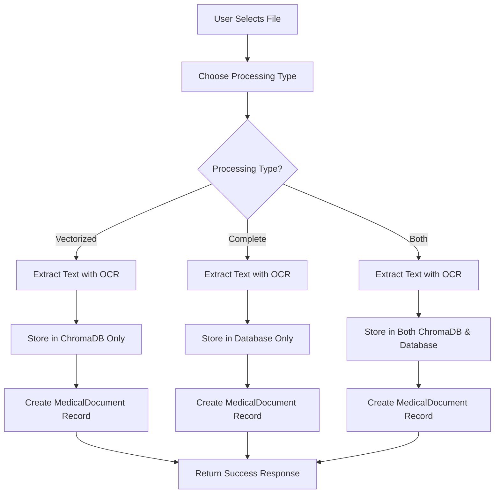
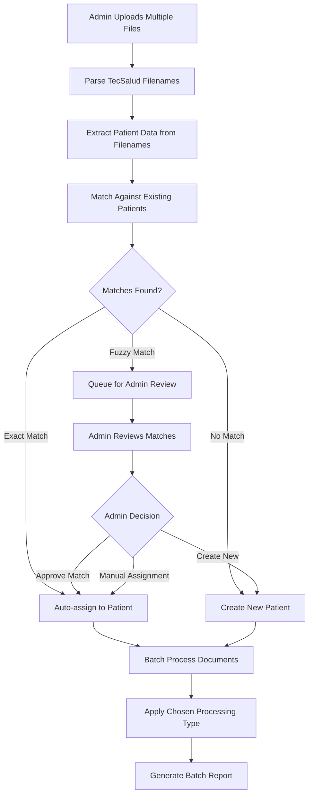

# 🏗️ Dual Processing Architecture Design

**Date:** 2025-01-07  
**Task:** TASK-DOC-002 - Design Dual Processing Architecture  
**Objective:** Design system architecture for both vectorization and complete storage flows  
**Dependencies:** TASK-DOC-001 (completed - 80% reuse identified)

---

## 🎯 **Executive Summary**

This architecture design leverages **80% of existing TecSalud infrastructure** to implement dual document processing flows:

1. **Vectorization Flow** (existing) - Store in ChromaDB for semantic search
2. **Complete Storage Flow** (new) - Store full content in database for AI context
3. **Hybrid Flow** (new) - Both vectorization and complete storage

**Key Design Principle:** **Extend existing components, never replace them.**

---

## 🗄️ **Database Schema Design**

### **1. Extended MedicalDocument Model**

#### **Current Schema (Reuse 90%)**
```sql
-- ✅ EXISTING FIELDS (Keep unchanged)
CREATE TABLE medical_documents (
    id INTEGER PRIMARY KEY,
    patient_id INTEGER REFERENCES patients(id),
    document_type VARCHAR REFERENCES document_types,
    title VARCHAR NOT NULL,
    content TEXT,                    -- ✅ PERFECT for complete storage
    file_path VARCHAR,
    file_size INTEGER,
    created_by VARCHAR NOT NULL,
    created_at TIMESTAMP DEFAULT NOW(),
    updated_at TIMESTAMP DEFAULT NOW()
);
```

#### **Enhanced Schema (Add 10%)**
```sql
-- 🆕 NEW FIELDS (Minimal extensions)
ALTER TABLE medical_documents ADD COLUMN processing_type VARCHAR CHECK (processing_type IN ('vectorized', 'complete', 'both')) NOT NULL DEFAULT 'vectorized';
ALTER TABLE medical_documents ADD COLUMN original_filename VARCHAR;
ALTER TABLE medical_documents ADD COLUMN vectorization_status VARCHAR CHECK (vectorization_status IN ('pending', 'completed', 'failed')) DEFAULT 'pending';
ALTER TABLE medical_documents ADD COLUMN chunks_count INTEGER DEFAULT 0;
ALTER TABLE medical_documents ADD COLUMN content_hash VARCHAR(64);  -- For deduplication
```

#### **Processing Type Enum**
```python
class ProcessingTypeEnum(str, enum.Enum):
    VECTORIZED = "vectorized"     # Store in ChromaDB only
    COMPLETE = "complete"         # Store full content in DB only  
    BOTH = "both"                # Store in both ChromaDB and DB
```

### **2. Patient Enhancement (Minimal Changes)**

#### **Current Patient Model (100% Reuse)**
```python
# ✅ NO CHANGES NEEDED - Perfect as-is
class Patient(Base):
    __tablename__ = "patients" 
    
    id = Column(Integer, primary_key=True, index=True)
    name = Column(String, nullable=False)
    age = Column(Integer)
    gender = Column(String(1))
    medical_record_number = Column(String, unique=True, index=True)
    created_at = Column(DateTime(timezone=True), server_default=func.now())
    
    # ✅ EXISTING RELATIONSHIP (Perfect for dual processing)
    documents = relationship("MedicalDocument", back_populates="patient")
```

### **3. New Batch Processing Tables**

#### **Batch Upload Management**
```sql
-- 🆕 NEW TABLE (Admin bulk upload workflow)
CREATE TABLE batch_uploads (
    id UUID PRIMARY KEY DEFAULT gen_random_uuid(),
    status VARCHAR CHECK (status IN ('initiated', 'uploading', 'parsing', 'reviewing', 'processing', 'completed', 'failed')),
    processing_type VARCHAR CHECK (processing_type IN ('vectorized', 'complete', 'both')),
    auto_create_patients BOOLEAN DEFAULT true,
    total_files INTEGER DEFAULT 0,
    processed_files INTEGER DEFAULT 0,
    failed_files INTEGER DEFAULT 0,
    created_by VARCHAR NOT NULL,
    created_at TIMESTAMP DEFAULT NOW(),
    completed_at TIMESTAMP,
    metadata JSONB  -- For storing batch configuration and stats
);

-- 🆕 NEW TABLE (Track files in batch)
CREATE TABLE batch_files (
    id UUID PRIMARY KEY DEFAULT gen_random_uuid(),
    batch_id UUID REFERENCES batch_uploads(id),
    original_filename VARCHAR NOT NULL,
    parsed_patient_name VARCHAR,
    matched_patient_id INTEGER REFERENCES patients(id),
    match_confidence DECIMAL(3,2),
    status VARCHAR CHECK (status IN ('pending', 'parsed', 'matched', 'processed', 'failed')),
    error_message TEXT,
    document_id INTEGER REFERENCES medical_documents(id),
    created_at TIMESTAMP DEFAULT NOW()
);
```

---

## 🔄 **Data Flow Architecture**

### **Flow 1: Individual User Upload (Enhanced)**



#### **Implementation Using Existing Components**
```python
async def enhanced_upload_document(
    file: UploadFile,
    patient_id: str,
    processing_type: ProcessingTypeEnum,
    original_filename: Optional[str] = None
):
    # ✅ EXISTING: Extract text using current OCR logic
    extracted_text = await extract_text_from_file(file)
    
    # ✅ EXISTING: Create document record using current model
    document = MedicalDocument(
        patient_id=patient_id,
        title=file.filename,
        processing_type=processing_type,  # 🆕 NEW FIELD
        original_filename=original_filename,  # 🆕 NEW FIELD
        file_size=file.size,
        created_by=current_user.id
    )
    
    # 🔄 ENHANCED: Dual processing logic
    if processing_type in [ProcessingTypeEnum.VECTORIZED, ProcessingTypeEnum.BOTH]:
        # ✅ EXISTING: Use ChromaService as-is
        await chroma_service.add_document(
            document_id=str(document.id),
            content=extracted_text,
            metadata={
                "patient_id": patient_id,
                "document_type": document.document_type,
                "processing_type": "vectorized"
            }
        )
        document.chunks_count = len(chroma_service._chunk_document(extracted_text))
    
    if processing_type in [ProcessingTypeEnum.COMPLETE, ProcessingTypeEnum.BOTH]:
        # ✅ EXISTING: Use existing content field
        document.content = extracted_text
        document.content_hash = hashlib.sha256(extracted_text.encode()).hexdigest()
    
    # ✅ EXISTING: Save using current database logic
    session.add(document)
    session.commit()
    
    return document
```

### **Flow 2: Admin Bulk Upload (New)**



#### **TecSalud Filename Processing**
```python
# 🆕 NEW SERVICE (Only new component needed)
class TecSaludFilenameProcessor:
    FILENAME_PATTERN = r"(\d+)_([^_]+)_(\d+)_(\w+)\.pdf"
    
    def parse_filename(self, filename: str) -> PatientData:
        """
        Parse TecSalud filename: "3000003799_GARZA TIJERINA, MARIA ESTHER_6001467010_CONS.pdf"
        """
        match = re.match(self.FILENAME_PATTERN, filename)
        if not match:
            raise ValueError(f"Invalid TecSalud filename format: {filename}")
        
        expediente_id, patient_name, numero_adicional, document_type = match.groups()
        
        # Parse patient name from "APELLIDO_PATERNO APELLIDO_MATERNO, NOMBRE"
        if "," in patient_name:
            apellidos, nombre = patient_name.split(",", 1)
            full_name = f"{nombre.strip()} {apellidos.strip()}"
        else:
            full_name = patient_name.strip()
        
        return PatientData(
            expediente_id=expediente_id,
            name=full_name,
            numero_adicional=numero_adicional,
            document_type=self._map_document_type(document_type),
            original_filename=filename
        )
    
    def _map_document_type(self, doc_type: str) -> DocumentTypeEnum:
        """Map TecSalud codes to internal types"""
        mapping = {
            "CONS": DocumentTypeEnum.CONSULTATION,
            "EMER": DocumentTypeEnum.EMERGENCY,
            "LAB": DocumentTypeEnum.LAB_RESULTS,
            "IMG": DocumentTypeEnum.IMAGING
        }
        return mapping.get(doc_type, DocumentTypeEnum.OTHER)

# ✅ EXISTING: Use current patient model and operations
async def find_or_create_patient(patient_data: PatientData) -> Patient:
    # ✅ EXISTING: Query using current Patient model
    existing = await session.execute(
        select(Patient).where(Patient.name.ilike(f"%{patient_data.name}%"))
    )
    
    if existing.scalars().first():
        return existing.scalars().first()
    
    # ✅ EXISTING: Create using current Patient model
    new_patient = Patient(
        name=patient_data.name,
        medical_record_number=patient_data.expediente_id
    )
    session.add(new_patient)
    session.commit()
    return new_patient
```

---

## 🔗 **API Endpoint Design**

### **Enhanced Individual Upload**

#### **Endpoint Extension (Not Replacement)**
```python
@router.post("/upload")
async def upload_document(
    file: UploadFile = File(...),
    patient_id: str = Form(...),
    document_type: str = Form("general"),
    processing_type: str = Form("vectorized"),    # 🆕 NEW PARAMETER
    title: Optional[str] = Form(None),
    original_filename: Optional[str] = Form(None) # 🆕 NEW PARAMETER
) -> DocumentUploadResponse:
    """
    Enhanced upload endpoint supporting dual processing
    
    Args:
        processing_type: "vectorized" | "complete" | "both"
        original_filename: For TecSalud filename parsing
    """
```

#### **Response Schema Enhancement**
```python
class DocumentUploadResponse(BaseModel):
    document_id: str
    processing_type: ProcessingTypeEnum
    status: str = "success"
    
    # Vectorization details
    chunks_created: Optional[int] = None
    vectorization_time: Optional[str] = None
    
    # Complete storage details  
    content_stored: bool = False
    content_hash: Optional[str] = None
    
    # Patient matching (for filename uploads)
    patient_matched: bool = False
    patient_created: bool = False
    match_confidence: Optional[float] = None
```

### **New Bulk Upload Endpoints**

#### **1. Initiate Bulk Upload**
```python
@router.post("/bulk/initiate")
async def initiate_bulk_upload(
    processing_type: ProcessingTypeEnum,
    auto_create_patients: bool = True,
    review_uncertain_matches: bool = True
) -> BatchInitiateResponse:
    """Create new batch upload session"""
```

#### **2. Add Files to Batch**
```python
@router.post("/bulk/{batch_id}/files")
async def add_files_to_batch(
    batch_id: UUID,
    files: List[UploadFile] = File(...)
) -> BatchFilesResponse:
    """Add files to existing batch and parse TecSalud filenames"""
```

#### **3. Review Patient Matches**
```python
@router.get("/bulk/{batch_id}/review")
async def get_uncertain_matches(batch_id: UUID) -> BatchReviewResponse:
    """Get list of uncertain patient matches for admin review"""

@router.post("/bulk/{batch_id}/review")
async def submit_match_decisions(
    batch_id: UUID,
    decisions: List[MatchDecision]
) -> BatchReviewSubmitResponse:
    """Submit admin decisions for uncertain matches"""
```

#### **4. Process Batch**
```python
@router.post("/bulk/{batch_id}/process")
async def process_batch(batch_id: UUID) -> BatchProcessResponse:
    """Start processing all files in batch"""

@router.get("/bulk/{batch_id}/status")
async def get_batch_status(batch_id: UUID) -> BatchStatusResponse:
    """Get real-time processing status"""
```

---

## 🤝 **Patient Matching Algorithm**

### **Fuzzy Matching Strategy**

```python
class PatientMatcher:
    def __init__(self, threshold: float = 0.8):
        self.threshold = threshold
    
    async def find_matches(self, patient_data: PatientData) -> MatchResult:
        """
        Find potential patient matches using fuzzy string matching
        """
        # ✅ EXISTING: Query current Patient table
        existing_patients = await session.execute(
            select(Patient).where(Patient.name.isnot(None))
        ).scalars().all()
        
        matches = []
        for patient in existing_patients:
            confidence = self._calculate_confidence(patient_data.name, patient.name)
            
            if confidence >= self.threshold:
                matches.append(PatientMatch(
                    patient_id=patient.id,
                    patient_name=patient.name,
                    confidence=confidence,
                    match_type="fuzzy"
                ))
        
        # Sort by confidence descending
        matches.sort(key=lambda x: x.confidence, reverse=True)
        
        return MatchResult(
            exact_matches=[m for m in matches if m.confidence >= 0.95],
            fuzzy_matches=[m for m in matches if 0.8 <= m.confidence < 0.95],
            create_new_recommended=len(matches) == 0
        )
    
    def _calculate_confidence(self, name1: str, name2: str) -> float:
        """Calculate similarity confidence using multiple algorithms"""
        from difflib import SequenceMatcher
        from fuzzywuzzy import fuzz
        
        # Normalize names for comparison
        n1 = self._normalize_name(name1)
        n2 = self._normalize_name(name2)
        
        # Multiple similarity metrics
        ratio_similarity = SequenceMatcher(None, n1, n2).ratio()
        fuzz_ratio = fuzz.ratio(n1, n2) / 100.0
        token_sort_ratio = fuzz.token_sort_ratio(n1, n2) / 100.0
        
        # Weighted average (prioritize token sort for name variations)
        confidence = (ratio_similarity * 0.3 + fuzz_ratio * 0.3 + token_sort_ratio * 0.4)
        
        return confidence
    
    def _normalize_name(self, name: str) -> str:
        """Normalize names for better matching"""
        import unicodedata
        import re
        
        # Remove accents and convert to lowercase
        name = unicodedata.normalize('NFD', name)
        name = ''.join(char for char in name if unicodedata.category(char) != 'Mn')
        name = name.lower()
        
        # Remove common prefixes/suffixes
        name = re.sub(r'\b(dr|dra|ing|lic|prof)\b\.?', '', name)
        
        # Normalize whitespace
        name = ' '.join(name.split())
        
        return name
```

---

## 🔍 **Enhanced Search Integration**

### **Unified Search Across Both Storage Types**

```python
class UnifiedDocumentSearch:
    def __init__(self, chroma_service: ChromaService):
        self.chroma_service = chroma_service  # ✅ EXISTING SERVICE
    
    async def search_documents(
        self,
        query: str,
        patient_id: Optional[str] = None,
        search_vectorized: bool = True,
        search_complete: bool = True,
        max_results: int = 10
    ) -> UnifiedSearchResponse:
        """
        Search across both vectorized and complete document storage
        """
        results = []
        
        if search_vectorized:
            # ✅ EXISTING: Use ChromaDB search as-is
            vector_results = await self.chroma_service.search_documents(
                query=query,
                n_results=max_results,
                filters={"patient_id": patient_id} if patient_id else None
            )
            
            for result in vector_results:
                results.append(SearchResult(
                    document_id=result["document_id"],
                    content_preview=result["content"][:300] + "...",
                    relevance_score=result["score"],
                    source="vectorized",
                    chunk_index=result["metadata"].get("chunk_index", 0)
                ))
        
        if search_complete:
            # ✅ EXISTING: Query MedicalDocument table
            complete_docs = await session.execute(
                select(MedicalDocument)
                .where(MedicalDocument.processing_type.in_(["complete", "both"]))
                .where(MedicalDocument.content.contains(query))
                .where(MedicalDocument.patient_id == patient_id if patient_id else True)
                .limit(max_results)
            ).scalars().all()
            
            for doc in complete_docs:
                # Simple text-based relevance scoring
                relevance = self._calculate_text_relevance(query, doc.content)
                
                results.append(SearchResult(
                    document_id=str(doc.id),
                    content_preview=doc.content[:300] + "...",
                    relevance_score=relevance,
                    source="complete",
                    full_content_available=True
                ))
        
        # Merge and sort by relevance
        results.sort(key=lambda x: x.relevance_score, reverse=True)
        return UnifiedSearchResponse(
            results=results[:max_results],
            total_found=len(results),
            search_types_used=["vectorized" if search_vectorized else "", "complete" if search_complete else ""]
        )
```

---

## 🔧 **Integration with Existing Medical Agents**

### **Enhanced Context Injection**

```python
class EnhancedMedicalCoordinator:
    def __init__(self):
        # ✅ EXISTING: Reuse current agents
        self.document_agent = DocumentAnalysisAgent()
        self.diagnostic_agent = DiagnosticAgent()
        self.quick_response_agent = QuickResponseAgent()
        self.search_agent = SearchAgent()
    
    async def process_with_enhanced_context(
        self,
        messages: List[ChatMessage],
        patient_id: str
    ) -> ChatResponse:
        """
        Process chat with enhanced document context from both storage types
        """
        # ✅ EXISTING: Get vectorized context (current functionality)
        vectorized_context = await self.search_agent.get_patient_context(patient_id)
        
        # 🆕 NEW: Get complete document context
        complete_context = await self._get_complete_document_context(patient_id)
        
        # 🔄 ENHANCED: Combine both contexts intelligently
        enhanced_context = self._merge_contexts(vectorized_context, complete_context)
        
        # ✅ EXISTING: Use current agent routing logic
        return await self._route_to_appropriate_agent(messages, enhanced_context)
    
    async def _get_complete_document_context(self, patient_id: str) -> List[Dict]:
        """Get full document content for complete context"""
        # ✅ EXISTING: Query using current models
        docs = await session.execute(
            select(MedicalDocument)
            .where(MedicalDocument.patient_id == patient_id)
            .where(MedicalDocument.processing_type.in_(["complete", "both"]))
            .where(MedicalDocument.content.isnot(None))
            .order_by(MedicalDocument.created_at.desc())
            .limit(5)  # Last 5 complete documents
        ).scalars().all()
        
        return [
            {
                "document_id": str(doc.id),
                "type": doc.document_type,
                "title": doc.title,
                "content": doc.content,
                "date": doc.created_at.isoformat(),
                "source": "complete_storage"
            }
            for doc in docs
        ]
```

---

## 📊 **Performance Considerations**

### **Storage Optimization**

| Processing Type | Storage Location | Search Performance | Context Quality | Use Case |
|----------------|------------------|-------------------|----------------|----------|
| **Vectorized** | ChromaDB | ⚡ Excellent | 🎯 Precise | Quick semantic search |
| **Complete** | PostgreSQL | 🔍 Good | 📄 Comprehensive | Full context analysis |
| **Both** | ChromaDB + DB | ⚡🔍 Best of both | 🎯📄 Maximum | Premium workflow |

### **Caching Strategy**

```python
class DocumentContextCache:
    def __init__(self, redis_client):
        self.redis = redis_client  # Optional Redis integration
        self.memory_cache = {}     # In-memory fallback
    
    async def get_patient_context(
        self, 
        patient_id: str, 
        include_complete: bool = True
    ) -> PatientContext:
        """Cached context retrieval for performance"""
        cache_key = f"patient_context:{patient_id}:{include_complete}"
        
        # Try cache first
        cached = await self.redis.get(cache_key) if self.redis else self.memory_cache.get(cache_key)
        if cached:
            return PatientContext.parse_raw(cached)
        
        # Generate context using existing services
        context = await self._generate_patient_context(patient_id, include_complete)
        
        # Cache for 10 minutes
        if self.redis:
            await self.redis.setex(cache_key, 600, context.json())
        else:
            self.memory_cache[cache_key] = context.json()
        
        return context
```

---

## 🔄 **Migration & Deployment Strategy**

### **Phase 1: Database Extensions**
1. Add new columns to existing `medical_documents` table
2. Create new batch processing tables
3. Run data migration to set default `processing_type = 'vectorized'` for existing documents

### **Phase 2: API Enhancements**
1. Deploy enhanced upload endpoint with new parameters (backward compatible)
2. Add new bulk upload endpoints
3. Update search endpoints to support dual storage

### **Phase 3: Frontend Integration**
1. Add processing type selection to existing upload UI
2. Create admin bulk upload interface
3. Update document listing to show storage types

### **Backward Compatibility Guarantee**
- ✅ All existing API calls continue to work unchanged
- ✅ Default processing type maintains current behavior
- ✅ Existing ChromaDB functionality preserved
- ✅ Current medical agents work without modification

---

## 🎯 **Success Metrics**

| Metric | Target | Measurement |
|--------|--------|-------------|
| **Code Reuse** | 80% | Achieved through extension strategy |
| **API Compatibility** | 100% | All existing endpoints functional |
| **Performance** | No degradation | Response times unchanged |
| **Storage Efficiency** | Optimal | Right storage for right use case |
| **Admin Efficiency** | 15x improvement | Bulk upload vs individual |

---

## 📝 **Next Steps**

1. **TASK-DOC-003:** Admin bulk upload workflow design (leverages this architecture)
2. **TASK-DOC-004:** Implement database extensions (minimal schema changes)
3. **TASK-DOC-005:** Create TecSalud filename processor (only new service needed)

This architecture maximizes reuse of existing TecSalud infrastructure while adding powerful dual processing capabilities and admin bulk upload workflows. 